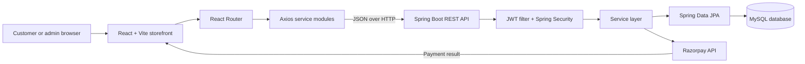
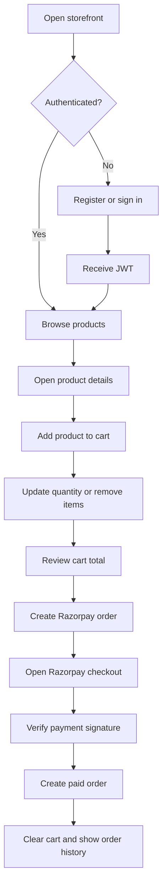
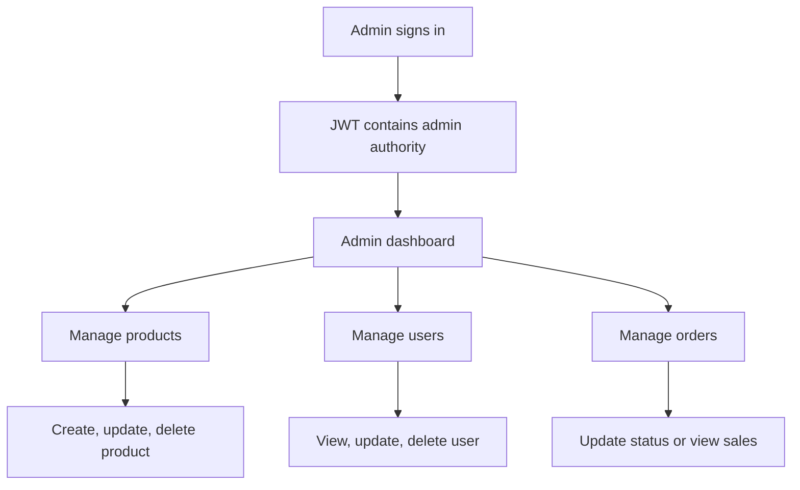
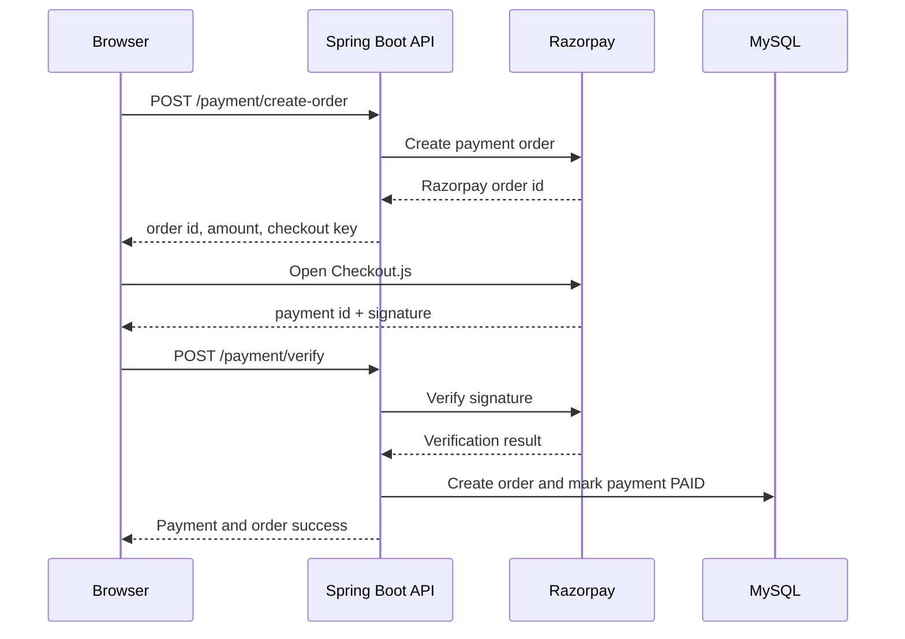
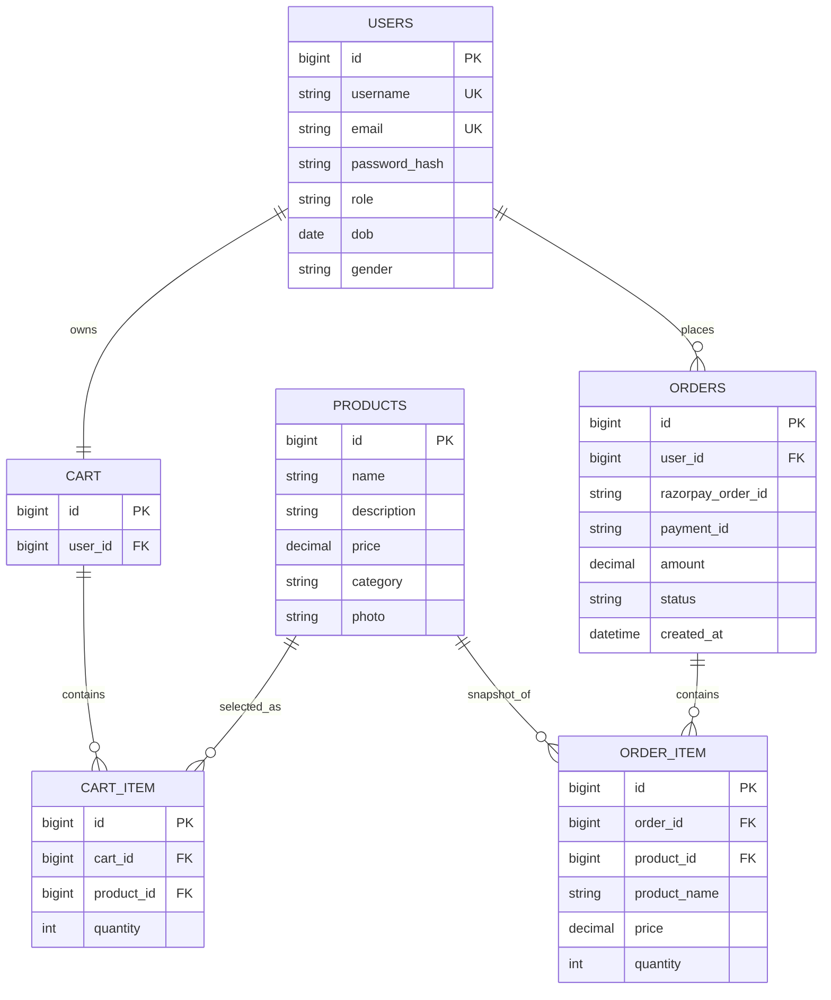

# SalesSavvy

SalesSavvy is a full-stack e-commerce application for discovering products, managing a personal cart, completing Razorpay payments, and tracking orders. It combines a React storefront with a Spring Boot REST API secured by JWT authentication.

## Problem Statement

Many small online stores start with disconnected product pages, manual order handling, and payment links. This creates friction for customers and makes it difficult for administrators to keep products, users, payments, and order status in sync.

SalesSavvy addresses this by providing one application for:

- Browsing and searching a product catalog
- Registering and signing in securely
- Managing cart quantities and items
- Creating and verifying Razorpay payments
- Reviewing order history and order status
- Managing products, users, and orders from an admin dashboard

## Why Build This Project?

The project was built to demonstrate a complete commerce workflow rather than an isolated UI or CRUD API. It brings together frontend routing, reusable React components, REST service modules, database persistence, JWT security, role-based authorization, and payment verification.

It is also a practical foundation for learning how to evolve a portfolio application toward production concerns such as:

- Clear frontend/backend boundaries
- DTO-based API responses
- Service-layer business rules
- Secure configuration through environment variables
- Ownership checks for user-specific data
- Testable payment and order workflows

## Features

### Customer features

- User registration and login
- JWT-based authentication
- Product listing, details, category browsing, and search
- Add products to cart
- Increase, decrease, remove, or clear cart items
- Razorpay order creation and signature verification
- Order history and order details
- Profile viewing and editing
- Responsive storefront UI

### Admin features

- Admin dashboard with product, user, and order views
- Add, update, and delete products
- View and manage users
- View all orders
- Update order status
- View total sales

### Engineering features

- Reusable React components for common UI, products, cart, and orders
- Central Axios service with JWT request interceptor
- Centralized backend exception handling
- Bean validation on request models
- BCrypt password hashing
- Method-level Spring Security authorization
- Environment-backed database, JWT, and Razorpay configuration
- CORS configuration for local frontend development

## System Architecture



### Layer responsibilities

| Layer | Responsibility |
| --- | --- |
| React pages | Compose customer and admin screens |
| React components | Reusable cards, forms, headers, loaders, modals, and summaries |
| React services | Keep API calls grouped by auth, cart, product, order, payment, and user domain |
| Axios API client | Adds Bearer token and handles expired sessions |
| Controllers | Define REST endpoints and translate requests into service calls |
| DTOs | Control the data shape exposed by the API |
| Services | Apply business rules and coordinate repositories |
| Repositories | Persist and query JPA entities |
| Spring Security | Authenticate JWTs and enforce roles |
| MySQL | Persist users, products, carts, cart items, and orders |
| Razorpay | Create payment orders and verify payment signatures |

## Customer Working Flow



## Admin Working Flow



## Payment Sequence



## Data Model



## Technology Stack

### Frontend

- React 19
- Vite 7
- React Router DOM 7
- Axios
- Bootstrap 5
- Bootstrap Icons
- JavaScript with JSX

### Backend

- Java 17 target
- Spring Boot 3.5
- Spring Web
- Spring Data JPA
- Spring Security
- JWT with `jjwt`
- Jakarta Bean Validation
- MySQL Connector/J
- Razorpay Java SDK
- Maven Wrapper

## API Reference

All protected endpoints require:

```http
Authorization: Bearer <jwt-token>
```

### Authentication

| Method | Endpoint | Purpose | Auth |
| --- | --- | --- | --- |
| `POST` | `/auth/signup` | Register a customer | Public |
| `POST` | `/auth/signin` | Authenticate and issue JWT | Public |
| `GET` | `/auth/test` | Verify an authenticated token | Authenticated |

### Products

| Method | Endpoint | Purpose | Auth |
| --- | --- | --- | --- |
| `GET` | `/products` | List products | Public |
| `GET` | `/products/{id}` | Get product details | Public |
| `GET` | `/products/search?keyword=` | Search products | Public |
| `GET` | `/products/category/{category}` | Filter by category | Public |
| `GET` | `/products/categories` | List categories | Public |
| `POST` | `/products` | Create product | Admin |
| `PUT` | `/products/{id}` | Update product | Admin |
| `DELETE` | `/products/{id}` | Delete product | Admin |

### Cart

| Method | Endpoint | Purpose | Auth |
| --- | --- | --- | --- |
| `GET` | `/cart/items?username=` | Get a user's cart | Owner |
| `GET` | `/cart/count?username=` | Get item count | Owner |
| `GET` | `/cart/total?username=` | Get cart total | Owner |
| `POST` | `/cart/add?productId=&quantity=` | Add product to cart | Authenticated |
| `PUT` | `/cart/update?username=&productId=&quantity=` | Update quantity | Owner |
| `DELETE` | `/cart/remove?username=&productId=` | Remove cart item | Owner |
| `DELETE` | `/cart/clear?username=` | Empty cart | Owner |

### Orders

| Method | Endpoint | Purpose | Auth |
| --- | --- | --- | --- |
| `POST` | `/orders/create` | Create order from cart | Owner |
| `GET` | `/orders/user/{username}` | Get user's orders | Owner |
| `GET` | `/orders/{id}` | Get order details | Authenticated |
| `PUT` | `/orders/{razorpayOrderId}/cancel` | Cancel an order | Authenticated |
| `GET` | `/orders` | List all orders | Admin |
| `PUT` | `/orders/{razorpayOrderId}/status` | Update order status | Admin |
| `GET` | `/orders/sales/total` | Get total sales | Admin |

### Payments and users

| Method | Endpoint | Purpose | Auth |
| --- | --- | --- | --- |
| `POST` | `/payment/create-order` | Create Razorpay order | Authenticated |
| `POST` | `/payment/verify` | Verify signature and create paid order | Authenticated |
| `GET` | `/payment/key` | Get Razorpay public key | Authenticated |
| `GET` | `/users/profile` | Get current user profile | Authenticated |
| `GET` | `/users/{username}` | Get own profile by username | Owner |
| `GET` | `/users` | List users | Admin |
| `PUT` | `/users/{id}` | Update user | Admin |
| `DELETE` | `/users/{id}` | Delete user | Admin |

## Project Structure

```text
Sales-Savvy/
├── sales-savvy-be/                 # Spring Boot backend
│   ├── src/main/java/com/salesSavvy/
│   │   ├── config/                 # Security, CORS, web configuration
│   │   ├── controller/             # REST API controllers
│   │   ├── dto/                    # API request/response models
│   │   ├── entity/                 # JPA entities
│   │   ├── exception/              # Domain and global error handling
│   │   ├── repository/             # Spring Data repositories
│   │   ├── security/               # JWT filter and utilities
│   │   └── service/                # Business logic
│   ├── src/main/resources/
│   │   └── application.properties
│   ├── pom.xml
│   └── .env.example
│
└── sales_savvy_fr/                 # React + Vite frontend
    ├── src/
    │   ├── components/             # Reusable UI and domain components
    │   ├── context/                # Authentication context
    │   ├── pages/                  # Route-level screens
    │   ├── services/               # API modules
    │   ├── App.jsx
    │   ├── App.css
    │   └── index.css
    ├── package.json
    └── vite.config.js
```

## Prerequisites

- Java 17 or newer
- Node.js 20 or newer
- npm
- MySQL 8 or compatible MySQL server
- Razorpay test or production account for payments

## Setup

### 1. Clone the repository

```bash
git clone https://github.com/sandeepmehta-s/Sales-Savvy.git
cd Sales-Savvy
```

### 2. Create the database

```sql
CREATE DATABASE ecom;
```

### 3. Configure the backend

Copy `sales-savvy-be/.env.example` to a local environment file and provide values for the database, JWT, and Razorpay settings. Do not commit real credentials.

The Spring configuration supports these variables:

```text
DB_URL=jdbc:mysql://localhost:3306/ecom
DB_USERNAME=root
DB_PASSWORD=your-database-password
JWT_SECRET=your-long-random-secret
JWT_EXPIRATION=86400000
RAZORPAY_KEY_ID=your-razorpay-key-id
RAZORPAY_KEY_SECRET=your-razorpay-key-secret
```

Start the backend:

```bash
cd sales-savvy-be
./mvnw spring-boot:run
```

Windows:

```powershell
cd sales-savvy-be
.\mvnw.cmd spring-boot:run
```

Backend URL: `http://localhost:8080`

### 4. Configure the frontend

Create `sales_savvy_fr/.env`:

```text
VITE_API_URL=http://localhost:8080
```

Install dependencies and start Vite:

```bash
cd sales_savvy_fr
npm install
npm run dev
```

Frontend URL: `http://localhost:5173`

## Build and Test

Frontend:

```bash
cd sales_savvy_fr
npm run lint
npm run build
```

Backend:

```bash
cd sales-savvy-be
./mvnw test
./mvnw clean package
```

## Security Notes

- Passwords are hashed with BCrypt before persistence.
- JWTs are required for protected API calls.
- Admin operations use method-level role authorization.
- User-specific cart, order, and profile endpoints validate the authenticated principal.
- Payment signatures are verified by the backend before order creation.
- Database, JWT, and Razorpay secrets should come from environment variables.
- Configure HTTPS, restrictive production CORS origins, secure secret storage, and database migrations before deployment.

## Current Limitations

- The frontend uses alert-based feedback in a few legacy flows; a shared toast/notification system would improve consistency.
- Some order operations should receive stricter ownership checks at the service boundary, not only at the controller boundary.
- A production payment flow should also use Razorpay webhooks and idempotency protection.
- The backend currently uses JPA `ddl-auto=update`; production deployments should use versioned migrations such as Flyway or Liquibase.
- Automated integration coverage should be expanded for controllers, JWT authorization, cart ownership, and payment verification.

## Roadmap

- Add a reusable `ProtectedRoute` and `AdminRoute` on the frontend.
- Replace browser alerts with a shared accessible notification component.
- Add pagination, filtering, and sorting to product and admin tables.
- Introduce persistent order status history and inventory tracking.
- Add Docker Compose for MySQL, backend, and frontend development.
- Add CI checks for frontend lint/build and backend tests.

## License

This repository is currently a portfolio project. Add a license file before distributing it as reusable software.
